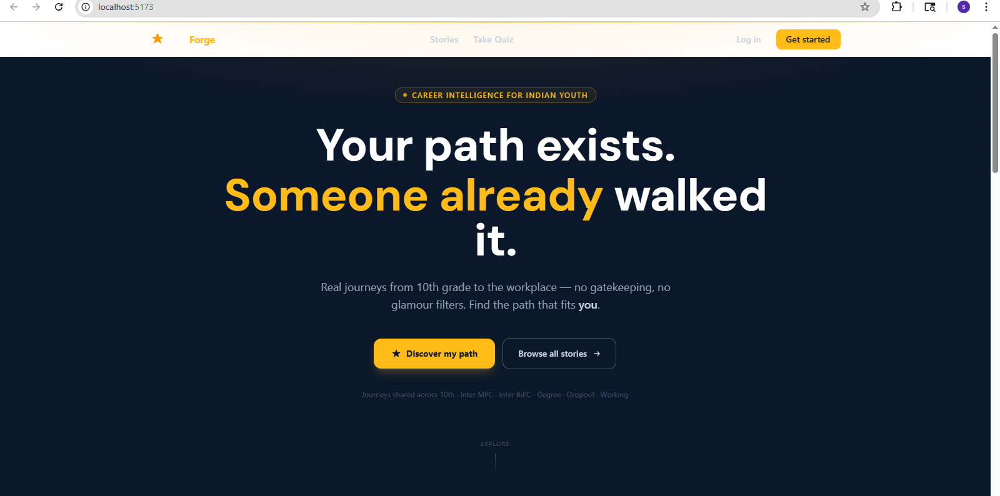
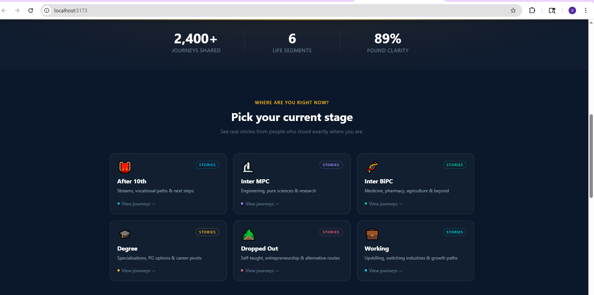
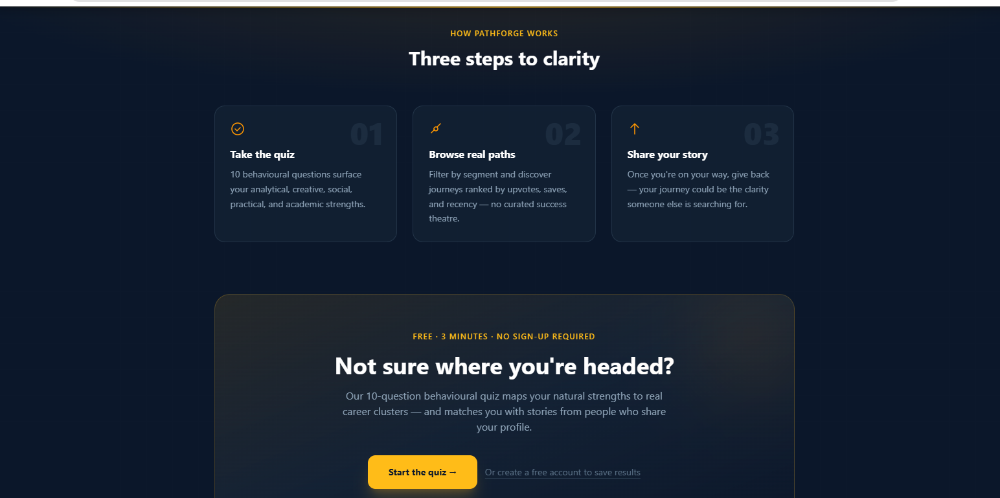
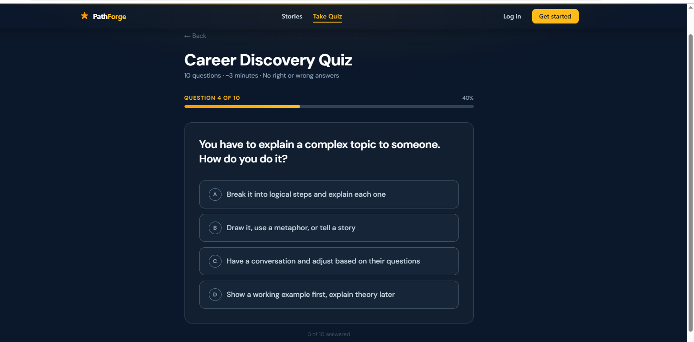
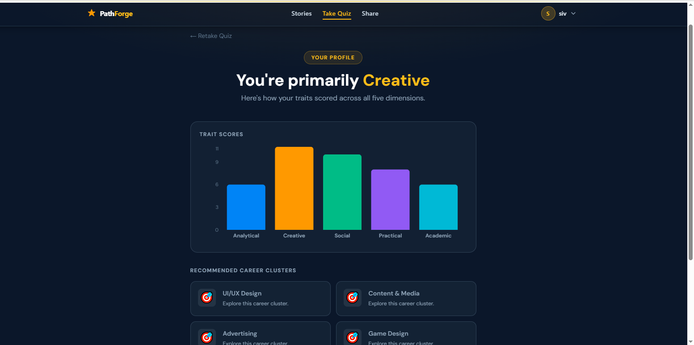

# PathForge 🔥

> Career decision intelligence for Indian youth — because your path shouldn't depend on who you know.

[](https://pathforge-gray.vercel.app)
[](./LICENSE)
[](#-tech-stack)
[](#)

**🌐 Live:** [pathforge-gray.vercel.app](https://pathforge-gray.vercel.app) &nbsp;|&nbsp; **⚙️ API:** [pathforge-wjyl.onrender.com](https://pathforge-wjyl.onrender.com)

---

## 🧠 The Problem

Every year, millions of Indian students make life-defining career choices based on:

- **Peer pressure** — "Everyone's doing engineering"
- **Parent expectations** — without exposure to alternatives
- **Zero structured guidance** — especially outside tier-1 cities

The result? Wrong careers, wasted years, and lost potential.

---

## 💡 The Solution

PathForge combines **behavioral analysis** with **real human journeys** to help students from age 10–30 discover careers that actually fit them.

No gatekeeping. No glamour filters. Just real paths from real people.

---

## 🚀 Features

### 👤 For Users
| Feature | Description |
|---|---|
| 🧠 Behavioral Quiz | 10 questions → scores across 5 personality traits |
| 📊 Career Recommendations | Dominant trait mapped to career clusters |
| 📚 Story Feed | Browse real journeys filtered by life stage |
| ❤️ Save & Upvote | Bookmark stories that resonate |
| ✍️ Submit Your Journey | Share your path to help others |

### 🛠 For Admins
| Feature | Description |
|---|---|
| ✅ Story Moderation | Approve or reject submitted stories |
| 📈 Platform Analytics | Users, stories, quiz attempts at a glance |
| 🎯 Segment Insights | Engagement breakdown by life stage |

---

## ⚙️ How It Works

```
User takes quiz (10 questions)
        ↓
Backend scores 5 traits:
  Analytical · Creative · Social · Practical · Academic
        ↓
Dominant trait → Career cluster match
        ↓
User explores real stories from that path
        ↓
Saves, upvotes, or submits their own journey
```

---

## 📸 Preview

### 🏠 Home


### 🎯 Choose Your Stage


### 📚 Story Feed


### 🧠 How It Works


### 🧪 Quiz


### 📊 Results


---

## 🧱 Tech Stack

| Layer | Technology |
|---|---|
| Frontend | React 18 (Vite) + Tailwind CSS |
| Backend | Node.js + Express |
| Database | MongoDB Atlas (Mongoose) |
| Auth | JWT + bcrypt |
| Charts | Recharts |
| State | Zustand + Context API |
| Deployment | Vercel (frontend) + Render (backend) |

---

## 📁 Project Structure

```
pathforge/
├── client/                   # React frontend (Vite + Tailwind)
│   └── src/
│       ├── pages/            # Home, Quiz, Stories, Dashboard, Admin...
│       ├── components/       # Navbar, UI components
│       ├── context/          # AuthContext
│       └── services/         # Axios API instance
│
└── server/                   # Express backend
    └── src/
        ├── controllers/      # Route handlers
        ├── models/           # Mongoose schemas
        ├── routes/           # API routes
        ├── middleware/        # Auth + admin guards
        └── services/         # Quiz scoring engine
```

---

## 🛠 Local Setup

### 1. Clone the repo
```bash
git clone https://github.com/sivakrishna916/pathforge.git
cd pathforge
```

### 2. Backend
```bash
cd server
npm install
cp .env.example .env    # fill in your values
npm run dev
```

### 3. Frontend
```bash
cd client
npm install
cp .env.example .env    # fill in your values
npm run dev
```

---

## 🌍 Environment Variables

**`server/.env`**
```env
MONGO_URI=your_mongodb_atlas_connection_string
JWT_SECRET=your_strong_secret_key
CLIENT_URL=http://localhost:5173
PORT=5000
NODE_ENV=development
```

**`client/.env`**
```env
VITE_API_URL=http://localhost:5000/api
```

---

## 🚀 Deployment

| Service | Platform | URL |
|---|---|---|
| Frontend | [Vercel](https://vercel.com) | [pathforge-gray.vercel.app](https://pathforge-gray.vercel.app) |
| Backend | [Render](https://render.com) | [pathforge-wjyl.onrender.com](https://pathforge-wjyl.onrender.com) |
| Database | [MongoDB Atlas](https://cloud.mongodb.com) | Hosted cluster |

> ⚠️ The backend is on Render's free tier — first request after inactivity may take ~30 seconds to wake up.

---

## 📌 What Makes This Different

- 🇮🇳 **Built for India** — segments match the Indian education system (10th, Inter MPC, BiPC, Degree, Dropout, Working)
- 🔐 **Role-based auth** — separate user and admin flows with JWT-protected routes
- 📊 **Trait-based scoring** — not a generic quiz, but a real behavioral engine across 5 dimensions
- 🏗 **Production-ready architecture** — protected routes, JWT interceptors, ranked story feed
- 🎨 **Polished UI** — dark theme, amber accent, fully mobile-responsive

---

## 🔮 Roadmap

- [ ] AI-powered career recommendations (OpenAI integration)
- [ ] Mentorship matching — connect users with story authors
- [ ] Advanced filters — college, city, budget
- [ ] Personalized story feed based on quiz results
- [ ] PWA support for mobile users

---

## 👨‍💻 Author

Built by **Sivakrishna Reddy** — 3rd year CSE student passionate about building products that matter.

[](https://github.com/sivakrishna916)

---

## ⭐ Support

If PathForge helped you or impressed you — drop a star. It genuinely means a lot.

---

*PathForge — Find your path. Walk it.*
